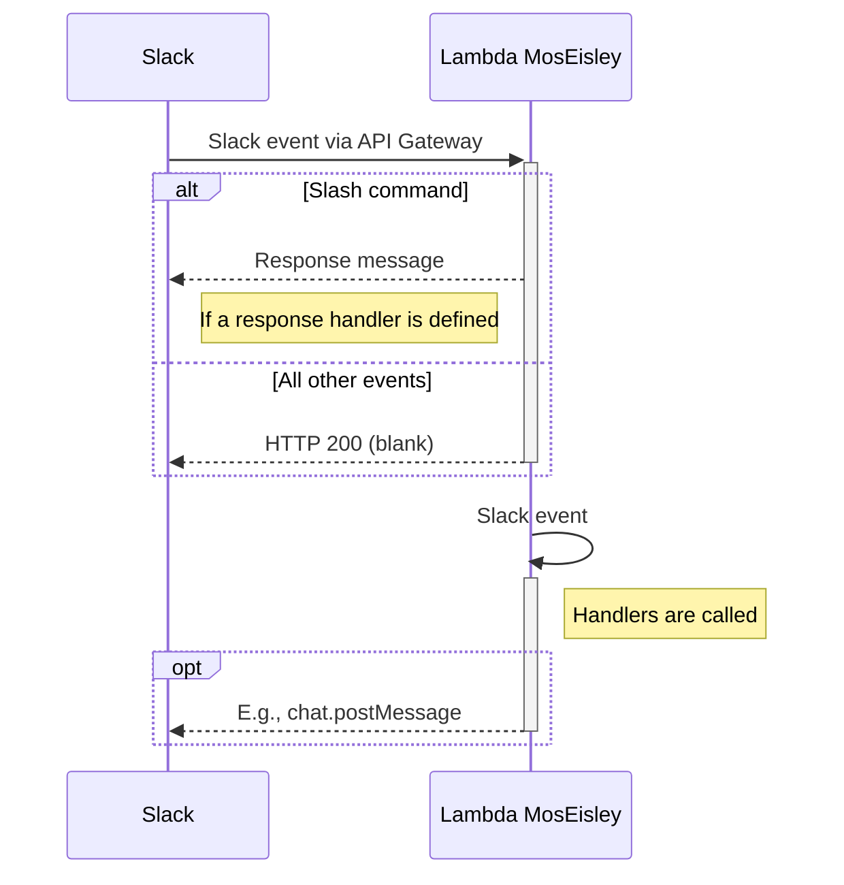

# mos-eisley-lambda

[](http://badge.fury.io/rb/mos-eisley-lambda) 

“You will never find a more wretched hive of scum and villainy.” – Obi-Wan Kenobi

Episode 2 of the Ruby based [Slack app](https://api.slack.com/) framework, this time for [AWS Lambda](https://aws.amazon.com/lambda/). Pure Ruby, no external gem/library dependency.

## Setup

### AWS

1. Create an IAM role for MosEisley Lambda function
1. Create a Lambda function for MosEisley
   - You can install this gem using [Lambda Layer](#using-with-lambda-layers) or just copy the `lib` directory to your Lambda code.
1. Create an HTTP API Gateway
   1. Create the appropriate routes (or use [the OpenAPI spec](https://github.com/kenjij/mos-eisley-lambda/blob/main/openapi3.yaml))
   1. Create Lambda integration and attach it to all the routes

Configure Lambda environment variable.

- `SLACK_CREDENTIALS_SSMPS_PATH`: hierarchy path to System Managers Parameter Store; e.g., `/slack/credentials/` would reference two parameters:
  - `/slack/credetials/signing_secret`
  - `/slack/credetials/bot_access_token`
- `MOSEISLEY_HANDLERS_DIR`: _optional_, if other than `./handlers` 
- `MOSEISLEY_LOG_LEVEL`: _optional_, could be `DEBUG`, `INFO`, `WARN`, or `ERROR` 
- `SLACK_LOG_CHANNEL_ID`: _optional_, if you want to use `ME::SlackWeb.post_log()`

Configure Lambda code in your `lambda_function.rb` file.

```ruby
require 'mos-eisley-lambda'
# Or, you can just copy the `lib` directory to your Lambda and...
# require_relative './lib/mos-eisley-lambda'

def lambda_handler(event:, context:)
  MosEisley::lambda_event(event, context)
end
```

### Slack

Create a Slack app and configure the following.

- **Interactivity & Shortcuts** – Request URL should be set to the `/actions` endpoint and Options Load URL should be set to the `/menus` endpoint.
- **Slash Commands** – Request URL should be set to the `/commands` endpoint.
- **OAuth & Permissions** – This is where you get the OAuth Tokens and set Scopes.
- **Event Subscriptions** – Request URL should be set to the `/events` endpoint. You'll likely Subscribe to bot events `app_mention` at a minimum.

### Handlers

Create your own Mos Eisley handlers as blocks and register them. By default, store these Ruby files in the `handlers` directory. Add handlers by passing a block to `MosEisley::Handler.add()` for the types below.

```ruby
:action
:command_response
:command
:event
:menu
:nonslack
```

`:command_response` types are Slack command keyword and response pair. The response is sent as-is back to Slack as an [immediate response](https://api.slack.com/interactivity/slash-commands#responding_immediate_response). `ME` is an alias to `MosEisley`.

```ruby
ME::Handler.add(:command_response, '/sample') do |event, myself|
  {
    response_type: "in_channel",
    text: "_Working on `#{event[:command]}`..._",
  }
end
```

Add handlers to process the Slack event.

```ruby
ME::Handler.add(:command, 'A Slack command') do |event, myself|
  next unless event[:command] == '/command'
  myself.stop
  txt = "Your wish is my command."
  payload = {
    response_type: 'ephemeral',
    text: txt,
    blocks: [ME::S3PO::BlockKit.sec_text(txt)],
  }
  ME::SlackWeb.post_response_url(event[:response_url], payload)
end
```

If your function receives non-Slack events, you can add handlers for that as well.

```ruby
ME::Handler.add(:nonslack, 'A CloudWatch event') do |event, myself|
  next unless event['source'] == 'aws.events'
  myself.stop
  channel = 'C123SLCK'
  txt = 'Shceduled event was received.'
  ME::SlackWeb.chat_postmessage(channel: channel, text: txt)
end
```

### Helpers

- `MosEisley::S3PO` – collection of helpers to analyze/create Slack messages.
- `MosEisley::SlackWeb` – methods for sending payloads to Slack Web API calls.

## Event Lifecycle

### Inbound

To an incoming Slack event, Mos Eisley will quickly respond with a blank HTTP 200. This is to keep [Slack's 3-second rule](https://api.slack.com/apis/connections/events-api#the-events-api__responding-to-events). To do this, handlers are not called yet, but the Slack event is passed on to a recursive asynchronous invoke and then the handlers are called.

The exception is when the incoming Slack event is for a slash command. You can define `:command_response` handlers for the purpose of generating a simple response message, but nothing more.



<!-- ### Outbound, Messaging Only

Invoke the function from another app to send a Slack message

1. Create a Slack message packaged to be sent to the API and invoke the function
1. Message is received, then sent to Slack API according to payload-->

## Using with Lambda Layers

Used the Makefile to create a zip file which can be uploaded to a Lambda Layer.

```sh
make
# Installs the gem to './ruby' then archives it to 'lambda-layers.zip'
```
